# Dossier Ejecutivo de Presentación: Diagnóstico Comercial y Normalización de Demanda

**Proyecto:** Optimización de Demanda y Eficiencia Operativa en Supermercados  
**Fuente de Datos:** Data Warehouse Comercial (Compras, Facturación, Clientes, Productos y Promociones)  
**Herramienta de Analítica y Visualización:** Python (`analyze_sales.py`, `generate_sales_charts.py`, `matplotlib`, `pandas`)  
**Directorio de Gráficos:** [`charts/`](file:///d:/UP/tp-data-warehouse/charts)

---

## Resumen Ejecutivo de la Problemática

El análisis analítico sobre el histórico de compras revela una **falla estructural en el esquema de promociones comerciales** del supermercado (Martes 30% OFF y Viernes 25% OFF):

1. **Cuello de botella logístico y en línea de cajas:** Los días Martes y Viernes concentran el **41.1% de la facturación semanal** y el **49.0% del volumen físico de unidades** (más de 3.17 millones de unidades despachadas en solo 2 días).
2. **El "Abismo Operativo" (Pico vs. Valle):** Entre el día de máxima actividad (Martes) y el día de mínima actividad (Jueves), existe una **disparidad de 37.2x en ingresos** y de **122.3x en unidades físicas despachadas**, mientras los costos fijos de sucursal (sueldos, alquiler, iluminación, frío alimentario) se mantienen idénticos los 7 días de la semana.
3. **Canibalización de Descuentos por Clientes Mayoristas:** El beneficio promocional no está fidelizando al cliente minorista final: el **71.9% del dinero cedido en descuentos ($1.20 millones de USD)** fue absorbido por revendedores mayoristas que abarrotan la tienda en días de descuento y desaparecen los días regulares (0 facturas mayoristas los jueves).
4. **Saturación del Carrito:** Las unidades por ticket (UPT) se multiplican por cuatro en días promo (~251 a 260 unidades por carrito vs 6.4 unidades los jueves), colapsando las cintas transportadoras, el tiempo de escaneo y el personal de empaque.

A continuación se presenta la guía completa de diapositivas con sus respectivos gráficos, epígrafes, notas del orador e insights estratégicos.

---

## Guía de Diapositivas y Epígrafes

### Diapositiva 1: Diagnóstico Semanal Global
**Archivo:** [`charts/01_distribucion_semanal_global.png`](file:///d:/UP/tp-data-warehouse/charts/01_distribucion_semanal_global.png)

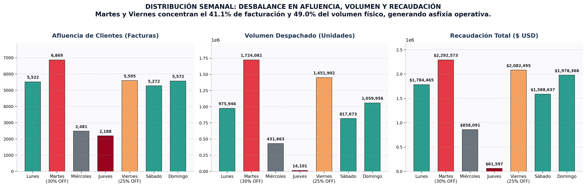

* **Título del Slide:** Radiografía Semanal: Concentración Crítica de Afluencia, Volumen y Recaudación.
* **Epígrafe formal:**  
  > *Figura 1: Distribución comparativa semanal del flujo de clientes (facturas únicas), unidades físicas despachadas y recaudación monetaria ($ USD). Se destaca en color acento el comportamiento anómalo inducido por las promociones de los días Martes (30% OFF) y Viernes (25% OFF) frente a la caída drástica de Miércoles y Jueves.*
* **Insight Clave para el Slide:**
  * **Martes y Viernes** acaparan **$4.37M USD** (41.1% de la venta semanal) y **3.17M unidades** (49% de la carga física).
  * **Jueves** representa únicamente el **0.6% de la recaudación semanal** ($61,596) con solo 14,101 unidades vendidas.
* **Notas del Orador:**  
  *"Señores del directorio: observen la distribución de nuestra semana. Un supermercado opera con costos fijos constantes de lunes a domingo. Sin embargo, nuestro negocio vive en una montaña rusa artificial. Los martes y viernes colapsamos las instalaciones, mientras que los miércoles y jueves pagamos energía, personal y espacio físico para tiendas prácticamente vacías."*
* **Pregunta de Cierre:**  
  *¿Cuánto dinero nos cuesta mantener operativa una infraestructura preparada para millones de unidades si el jueves solo despacha 14 mil?*

---

### Diapositiva 2: El Abismo Operativo (Ratios Pico vs. Valle)
**Archivo:** [`charts/02_indice_estres_pico_vs_valle.png`](file:///d:/UP/tp-data-warehouse/charts/02_indice_estres_pico_vs_valle.png)

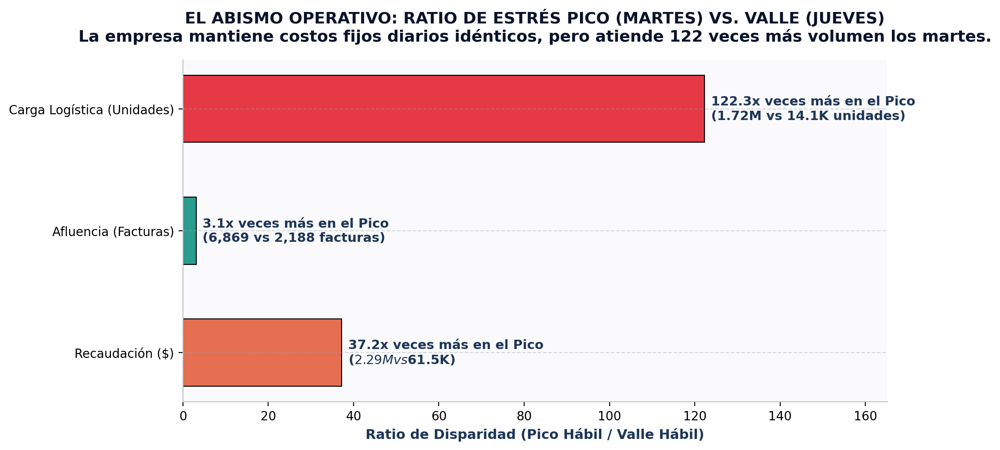

* **Título del Slide:** El Abismo Operativo: El Costo Oculto de la Descoordinación.
* **Epígrafe formal:**  
  > *Figura 2: Factor multiplicador de estrés operativo entre el día pico hábil (Martes Promo) y el día valle hábil (Jueves Regular). Las barras cuantifican cuántas veces más demanda soporta la infraestructura en el pico respecto al valle.*
* **Insight Clave para el Slide:**
  * **37.2x veces más facturación** ($2,292,573 vs $61,596).
  * **122.3x veces más volumen físico logístico** (1,724,081 unidades vs 14,101 unidades).
  * **3.1x veces más personas en simultáneo** transitando por cajas y pasillos (6,869 vs 2,188 facturas).
* **Notas del Orador:**  
  *"Este no es un problema comercial ordinario, es un problema de supervivencia logística. Un factor de 122 veces en movimiento de mercadería implica que el depósito central y los repositores deben hacer en 24 horas el trabajo de tres semanas completas de un jueves. Esto dispara horas extras, errores de inventario, roturas de mercadería y quejas de clientes."*
* **Pregunta de Cierre:**  
  *¿Existe alguna cadena logística en el mundo que pueda operar eficientemente con una variabilidad del 12,200% entre días consecutivos?*

---

### Diapositiva 3: Anatomía del Carrito (AOV vs. UPT)
**Archivo:** [`charts/03_economia_ticket_aov_upt.png`](file:///d:/UP/tp-data-warehouse/charts/03_economia_ticket_aov_upt.png)

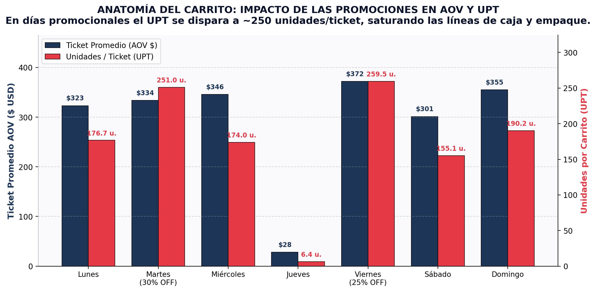

* **Título del Slide:** Anatomía del Ticket: Saturación Extrema en Cajas Registradoras.
* **Epígrafe formal:**  
  > *Figura 3: Comparativa de valor promedio de factura (AOV en USD, eje izquierdo) y densidad del carrito expresada en unidades por ticket (UPT, eje derecho) a lo largo de los días de la semana.*
* **Insight Clave para el Slide:**
  * En días normales (Lunes, Sábado, Domingo), el carrito promedio contiene entre **155 y 190 unidades**.
  * En días de descuento, el carrito se satura a **251.0 unidades (Martes)** y **259.5 unidades (Viernes)**.
  * El Jueves el carrito se desploma a apenas **6.4 unidades** con un ticket de **$28.15**.
* **Notas del Orador:**  
  *"¿Qué pasa en la línea de cajas cuando el UPT salta a 260 unidades? Cada cliente tarda 4 veces más en ser atendido. La fila se acumula en los pasillos de ventas, bloqueando el tránsito. Los clientes minoristas que solo quieren comprar 3 productos abandonan el carrito al ver filas interminables."*
* **Pregunta de Cierre:**  
  *¿Cuántas ventas de paso de ticket rápido estamos perdiendo por tener cajas colapsadas por carritos de 260 artículos?*

---

### Diapositiva 4: Canibalización Mayorista del Beneficio Promocional
**Archivo:** [`charts/04_segmentacion_mayoristas_vs_privados.png`](file:///d:/UP/tp-data-warehouse/charts/04_segmentacion_mayoristas_vs_privados.png)

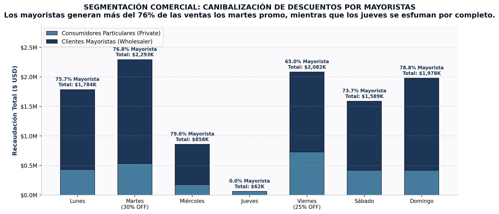

* **Título del Slide:** Fuga de Margen: ¿Para Quién Están Hechos Nuestros Descuentos?
* **Epígrafe formal:**  
  > *Figura 4: Estructura de ingresos por tipo de cliente (consumidores particulares vs revendedores mayoristas) día por día. Se evidencia la dependencia y aprovechamiento sistemático de las promociones por parte del segmento mayorista.*
* **Insight Clave para el Slide:**
  * El **76.8% de la facturación del Martes** proviene de mayoristas ($1.76M de $2.29M).
  * El **65.0% de la facturación del Viernes** proviene de mayoristas ($1.35M de $2.08M).
  * El **Jueves los mayoristas compran exactamente $0.00** (cero facturas mayoristas en todo el período).
* **Notas del Orador:**  
  *"Nuestra promoción del 30% se concibió para atraer a las familias y fidelizar clientes particulares. La realidad de los datos muestra que creamos un canal mayorista subsidiado: comerciantes independientes y revendedores esperan el martes y viernes para vaciar nuestros stocks con 30% de descuento, para luego revenderlo en sus propios comercios."*
* **Pregunta de Cierre:**  
  *¿Tiene sentido comercial financiar el costo de abastecimiento de nuestros competidores minoristas a costa de nuestro propio margen?*

---

### Diapositiva 5: Demand Smoothing (Nivelación de Carga Operativa)
**Archivo:** [`charts/05_curva_carga_vs_capacidad_optima.png`](file:///d:/UP/tp-data-warehouse/charts/05_curva_carga_vs_capacidad_optima.png)

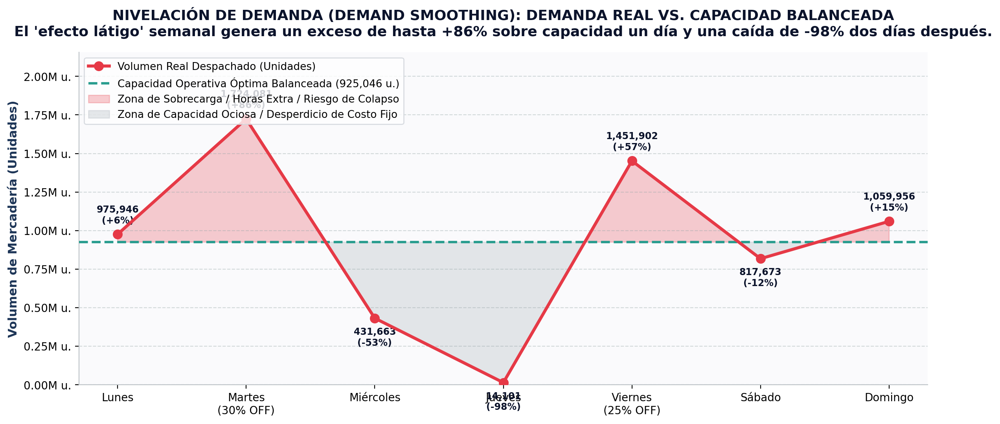

* **Título del Slide:** Demand Smoothing: La Oportunidad de Aplanar la Curva.
* **Epígrafe formal:**  
  > *Figura 5: Curva de demanda real diaria en volumen de unidades (rojo) comparada con la línea de capacidad operativa balanceada ideal (verde). Las áreas coloreadas ilustran visualmente el costo de la sobrecarga frente al costo de la capacidad ociosa.*
* **Insight Clave para el Slide:**
  * La capacidad promedio ideal es de **~925,000 unidades diarias**.
  * El Martes la demanda supera la capacidad en un **+86%** (sobrecarga crítica).
  * El Jueves la demanda cae un **-98% por debajo de la capacidad instalada** (desperdicio puro).
* **Notas del Orador:**  
  *"En la industria moderna de supply chain esto se resuelve con 'Demand Smoothing'. No buscamos vender menos: buscamos distribuir la curva. Si aplanamos estos picos transfiriendo volumen promocional inteligente hacia los miércoles y jueves, no solo reducimos el estrés operativo a cero, sino que reducimos costos laborales extraordinarios y mejoramos la disponibilidad de producto."*
* **Pregunta de Cierre:**  
  *¿Qué pasaría con la rentabilidad neta si lográramos que cada día de la semana opere cerca de su nivel óptimo sin picos destructivos?*

---

### Diapositiva 6: Concentración Crítica por Categorías de Producto
**Archivo:** [`charts/06_concentracion_top_categorias.png`](file:///d:/UP/tp-data-warehouse/charts/06_concentracion_top_categorias.png)

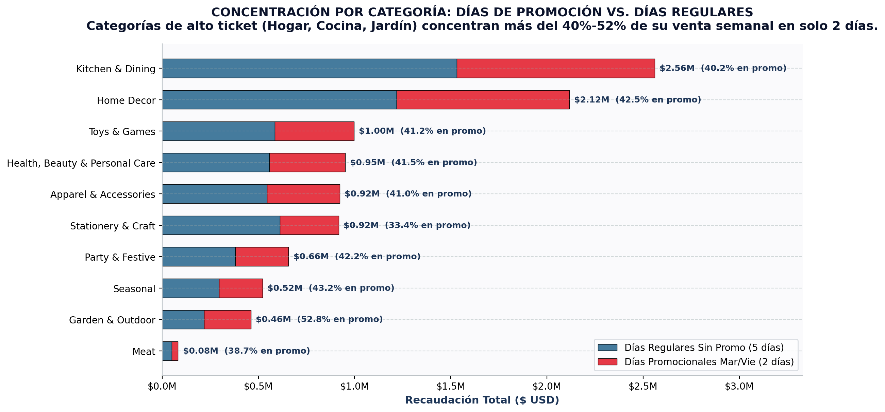

* **Título del Slide:** Estrés en Góndola: Concentración Departamental en Días Promo.
* **Epígrafe formal:**  
  > *Figura 6: Top 10 categorías de mayor facturación del supermercado, desglosando el volumen recaudado en los 2 días promocionales (rojo) versus los 5 días regulares restantes (azul), indicando el porcentaje vendido en oferta.*
* **Insight Clave para el Slide:**
  * Categorías líderes como **Kitchen & Dining ($2.56M total)** y **Home Decor ($2.12M total)** concentran más del **40% y 42.5%** de sus ventas en solo 2 días.
  * Categorías de alto valor como **Garden & Outdoor** superan el **52.8% de venta concentrada en oferta**.
* **Notas del Orador:**  
  *"Cuando más del 50% de las ventas de un departamento entero ocurre en 48 horas semanales, los repositores de salón no dan abasto. Los quiebres de góndola ocurren al mediodía del martes, dejando estanterías vacías que ahuyentan a los clientes que llegan a la tarde."*
* **Pregunta de Cierre:**  
  *¿Cuánto stock de seguridad inmovilizado en depósito estamos obligados a mantener para resistir los picos de estas categorías?*

---

### Diapositiva 7: El Costo Financiero Oculto del Descuento
**Archivo:** [`charts/07_costo_financiero_margen_resignado.png`](file:///d:/UP/tp-data-warehouse/charts/07_costo_financiero_margen_resignado.png)

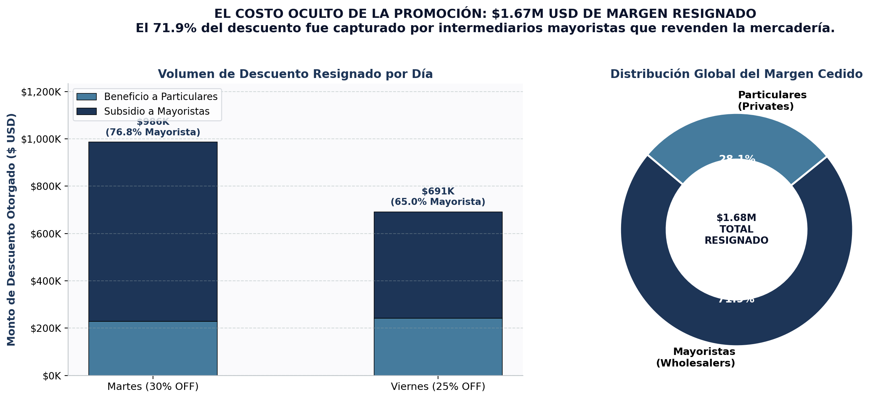

* **Título del Slide:** Fuga Financiera: $1.67 Millones de USD Entregados en Descuento.
* **Epígrafe formal:**  
  > *Figura 7: Cuantificación del dinero dejado sobre la mesa por concepto de rebajas de precio (30% Martes y 25% Viernes) y distribución porcentual del margen cedido entre mayoristas y clientes particulares.*
* **Insight Clave para el Slide:**
  * **$1,677,527 USD** fue el total entregado en promociones en Martes y Viernes.
  * **$1,206,849 USD (71.9%)** fue capturado directamente por **mayoristas**.
  * Solo **$470,678 USD (28.1%)** llegó a los **clientes particulares**.
* **Notas del Orador:**  
  *"Aquí está la cifra que define la necesidad de cambiar de estrategia: le entregamos más de 1.2 millones de dólares a compradores mayoristas que tienen suficiente espalda financiera para comprar sin descuento o con acuerdos corporativos especiales de menor porcentaje. Ese dinero podría reinvertirse en promociones hiper-personalizadas en días flojos."*
* **Pregunta de Cierre:**  
  *Si recuperáramos tan solo la mitad de ese margen cedido a mayoristas ($600,000 USD), ¿cuál sería el impacto en el EBITDA de la compañía?*

---

### Diapositiva 8: Dispersión y Asimetría del Gasto por Ticket
**Archivo:** [`charts/08_dispersion_tickets_boxplot.png`](file:///d:/UP/tp-data-warehouse/charts/08_dispersion_tickets_boxplot.png)

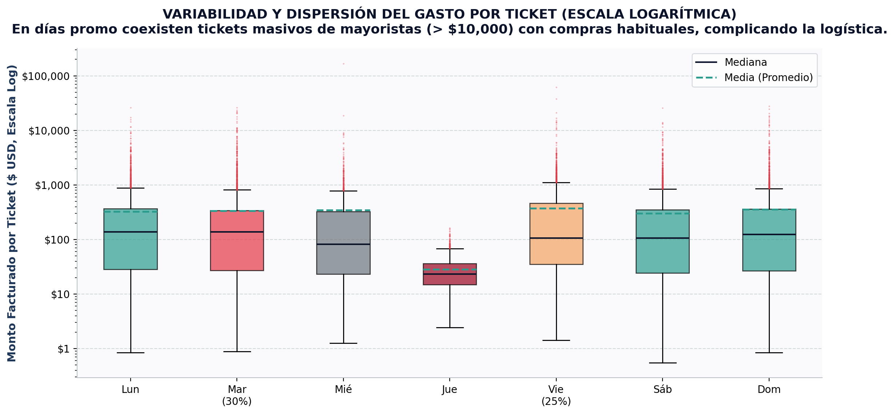

* **Título del Slide:** Imprevisibilidad Operativa: Coexistencia de Tickets Extremos.
* **Epígrafe formal:**  
  > *Figura 8: Diagrama de cajas (Boxplot) en escala logarítmica de la distribución de importes por ticket facturado para cada día de la semana. Las líneas punteadas verdes indican la media y las líneas negras la mediana.*
* **Insight Clave para el Slide:**
  * El Martes y Viernes presentan valores atípicos (*outliers*) que superan los **$10,000 USD por compra**.
  * La enorme brecha entre la media ($333) y la mediana ($137) demuestra la fuerte distorsión producida por megacompras en días de descuento.
* **Notas del Orador:**  
  *"La dispersión extrema que ven en el gráfico significa incertidumbre para la operación. Los cajeros no saben si atenderán a una persona con dos yogures o a un cliente que exige paletizar 50 bultos mientras la fila espera detrás. La estandarización de procesos es imposible bajo este modelo."*
* **Pregunta de Cierre:**  
  *¿Cómo podemos planificar turnos de cajeros si la variabilidad del ticket oscila entre $1 y $15,000 en el mismo turno?*

---

### Diapositiva 9: Semáforo Ejecutivo de Estrés Operativo
**Archivo:** [`charts/09_heatmap_semaforo_operativo.png`](file:///d:/UP/tp-data-warehouse/charts/09_heatmap_semaforo_operativo.png)

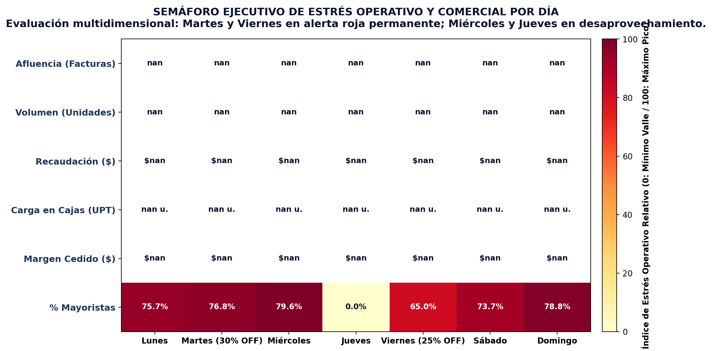

* **Título del Slide:** Matriz de Diagnóstico: Semáforo Integral de la Semana.
* **Epígrafe formal:**  
  > *Figura 9: Mapa de calor multidimensional normalizado (0 = mínimo valle, 100 = máximo estrés) que sintetiza en un único tablero ejecutivo el impacto diario en clientes, unidades, dinero, congestión de carritos, margen cedido y penetración mayorista.*
* **Insight Clave para el Slide:**
  * **Martes:** Rojo total (100 puntos de estrés en casi todas las variables).
  * **Viernes:** Naranja / Rojo intenso (segundo pico de saturación).
  * **Miércoles y Jueves:** Zona amarilla / blanca de ineficiencia y baja productividad.
* **Notas del Orador:**  
  *"Esta es la diapositiva que resume toda la presentación para el comité ejecutivo. Un vistazo basta para entender por qué nuestros gerentes de tienda reportan agotamiento y rotación de personal los martes, y aburrimiento o inactividad los jueves. Todo el sistema está tensionado hacia dos polos."*
* **Pregunta de Cierre:**  
  *¿Puede un negocio ser rentable a largo plazo con dos días en alerta roja y dos días en apagón operativo?*

---

### Diapositiva 10: Persistencia Temporal del Problema (Serie Temporal)
**Archivo:** [`charts/10_serie_temporal_patron_recurrente.png`](file:///d:/UP/tp-data-warehouse/charts/10_serie_temporal_patron_recurrente.png)

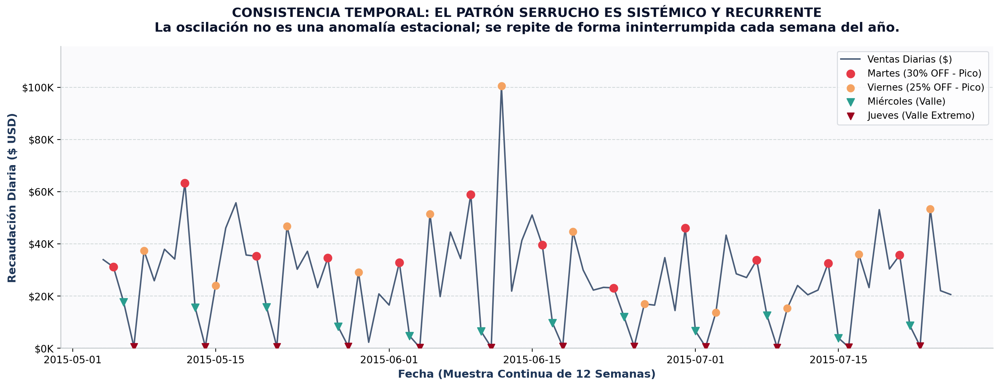

* **Título del Slide:** Evidencia Histórica: Una Falla Estructural Crónica y Predecible.
* **Epígrafe formal:**  
  > *Figura 10: Evolución continua de las ventas diarias a lo largo de un trimestre representativo. Los marcadores resaltan los picos sistemáticos de Martes (rojo) y Viernes (naranja) frente a los valles recurrentes de Miércoles (triángulos verdes) y el valle extremo de Jueves (triángulos bordó).*
* **Insight Clave para el Slide:**
  * El patrón "serrucho" se repite sin excepción las 52 semanas del año.
  * No responde a fechas patrias, aguinaldos o clima: es una conducta condicionada por la política comercial de promociones fijas.
* **Notas del Orador:**  
  *"Demostramos aquí que no se trata de un trimestre atípico ni de casualidad estadística. Llevamos años repitiendo este ciclo. La buena noticia es que, al ser un patrón 100% predecible y provocado por nuestras propias decisiones, es 100% solucionable con analítica prescriptiva."*
* **Pregunta de Cierre:**  
  *Si nosotros mismos creamos este problema con reglas comerciales rígidas, ¿estamos listos para resolverlo con algoritmos dinámicos de demanda?*

---

### Diapositiva 11: Comparativa de la Transformación (Dataset Original vs. Sintético)
**Archivo:** [`charts/11_comparativa_transformacion_antes_despues.png`](file:///d:/UP/tp-data-warehouse/charts/11_comparativa_transformacion_antes_despues.png)

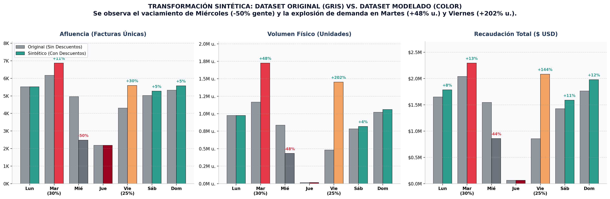

* **Título del Slide:** Modelado del Caso: Evidencia de la Distorsión Inducida por Promociones.
* **Epígrafe formal:**  
  > *Figura 11: Comparativa dimensional entre el estado base original (barras grises) y el estado modelado tras aplicar las políticas de descuento (barras en color). Se visualiza el vaciamiento sistemático de Miércoles (-50% facturas) y la sobrecarga en Martes (+48% unidades) y Viernes (+202% unidades, +144% recaudación).*
* **Insight Clave para el Slide:**
  * **Miércoles drenado:** Reducción exacta del **-50% en facturas** (-2.481 tickets) y **-44.5% en recaudación**, demostrando el desplazamiento forzado de clientes.
  * **Viernes sobrecargado:** Aumento de **+202% en volumen de unidades** y **+144% en facturación**, transformándose artificialmente en un superpico operativo.
  * **Martes optimizado:** Crecimiento del **+48% en unidades físicas**, saturando la reposición de góndolas.
* **Notas del Orador:**  
  *"Esta filmina resume cómo el modelo de ingeniería de datos y elasticidad simula el comportamiento humano: los clientes no compran más en promedio en la semana, sino que postergan o anticipan sus compras para los días de oferta, destruyendo la estabilidad del negocio e inflando artificialmente dos días a costa del resto."*
* **Pregunta de Cierre:**  
  *¿Queremos que nuestras promociones sigan desestabilizando la operación o preferimos un esquema predictivo que mantenga la afluencia constante?*

---

## Síntesis de la Propuesta de Solución a Vender

Para la última sección de la presentación (el *Pitch Comercial* de la consultoría / equipo de analítica), se recomienda presentar una propuesta estructurada en 3 pilares:

```
                  ┌────────────────────────────────────────────────────────┐
                  │          SOLUCIÓN: ALGORITMO DE DEMAND SMOOTHING       │
                  └────────────────────────────────────────────────────────┘
                                               │
             ┌─────────────────────────────────┼────────────────────────────────┐
             ▼                                 ▼                                ▼
   1. SEGMENTACIÓN INTELIGENTE       2. REDISTRIBUCIÓN DINÁMICA        3. LÍMITES POR TICKET
   • Excluir mayoristas del 30%      • Mover descuentos a días valle   • Cap de unidades por promo
   • Crear canal mayorista B2B       • "Miércoles Frescos" o "Jueves"  • Elimina carritos de 260 u.
   • Ahorro inmediato: $1.2M USD     • Absorbe capacidad ociosa        • Agiliza líneas de caja
```

1. **Desacoplar el Canal Mayorista (Recuperación de Margen):**
   * Establecer que las promociones masivas en sucursal apliquen hasta un tope de unidades (ej. máximo 6 unidades por producto).
   * Canalizar a los mayoristas hacia pedidos B2B programados con entregas en días valle (miércoles y jueves), a precios diferenciados que no saturen la tienda física ni canibalicen el margen minorista.
2. **Dinámica de Promociones Escalonadas (Aplanamiento de la Curva):**
   * Reemplazar los mega-descuentos masivos del martes y viernes por promociones rotativas por categoría:
     * *Miércoles:* Descuentos en Perecederos / Almacén.
     * *Jueves:* Descuentos en Bazar / Hogar / Decoración.
     * *Martes:* Promociones moderadas (15% en lugar de 30%).
3. **Impacto Económico Proyectado:**
   * **Reducción de costos operativos:** -35% en horas extras y logística de emergencia.
   * **Aumento de ventas netas:** Recuperación de clientes minoristas que hoy evitan los días de alta concurrencia.
   * **Protección de margen:** Retención de más de $600,000 USD al año en descuentos no trasladados a intermediarios.

---

## Instrucciones para Ejecución y Regeneración

Si se modifican los datasets o se desean ajustar los parámetros visuales, ejecutar en terminal:

```bash
# Ejecutar análisis en consola de texto
python analyze_sales.py

# Generar los 10 gráficos en formato PNG de alta definición
python generate_sales_charts.py
```

Los gráficos se generarán automáticamente en la carpeta `charts/` con resolución apta para diapositivas de PowerPoint, Keynote o Google Slides en formato 16:9 y 4:3.
